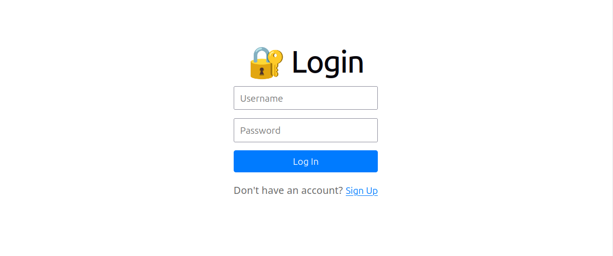
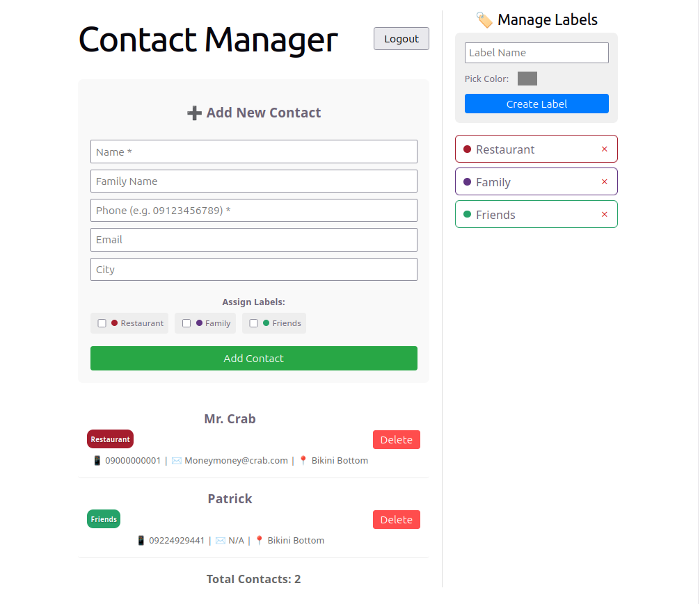

# Contact Manager

A full-stack contact management web application built to practice modern web development concepts, secure REST API design, and database relationship mapping.

## 📱 Overview

This project is a feature-rich Contact Manager designed to help users securely store, organize, and filter their personal contacts. Built with a decoupled architecture, it features a high-performance Python backend paired with a dynamic React frontend, focusing on clean code practices and robust data validation.

## Screenshots

### Login Screen



### Dashboard (Logged In)



## ✨ Features

### User Authentication

Secure user registration and login with strict password strength validation.

### Contact CRUD

Full capabilities to create, read, update, and delete contact details.

### Label Categorization

Organize contacts using customized labels via a many-to-many relationship mapping.

### Advanced Search & Filtering

Quick search across names, family names, or phone numbers, with additional filters for specific cities and labels.

### Robust Input Validation

Server-side regex and constraint checks for emails, phone numbers, and formatting.

## 🛠️ Technologies Used

### Backend

* FastAPI
* SQLModel (SQLAlchemy)
* SQLite
* Pydantic

### Frontend

* React
* Modern CSS Framework

### Tools

* Uvicorn
* Git

## 🚀 Installation Guide

### Prerequisites

* Python 3.10+
* Node.js & npm

###Clone the Repository

```bash
git clone https://github.com/your-username/contact-manager.git
cd contact-manager
```

### Backend Setup

1. Navigate to the backend directory:

```bash
cd backend
```

2. Create and activate a virtual environment:

```bash
python -m venv venv
source venv/bin/activate  # On Windows: venv\Scripts\activate
```

3. Install dependencies:

```bash
pip install -r requirements.txt
```

4. Start the FastAPI development server:

```bash
uvicorn main:app --reload
```

### Frontend Setup

1. Navigate to the frontend directory:

```bash
cd ../frontend
```

2. Install the node packages:

```bash
npm install
```

3. Run the frontend application:

```bash
npm run dev
```

## 💡 Usage

1. Open your browser and navigate to the frontend local address (typically `http://localhost:5173`).
2. Create a new account via the Register page using a valid username and a strong password.
3. Log in to access your personal dashboard.
4. Start adding contacts, assigning labels, and managing your network.
5. Explore the interactive API documentation at `http://localhost:8000/docs`.

## 📝 To-Do / Future Enhancements

* [ ] Add a password reveal toggle switch on login/register forms.
* [ ] Implement a comprehensive label management dashboard (create, edit, and delete standalone labels).
* [ ] Refine the UI/UX design for better responsiveness and modern aesthetics.
* [ ] Implement pagination for accounts with large numbers of contacts.

## 🎯 Purpose

This project serves as a practical application of full-stack engineering principles. It highlights implementation skills regarding relational database structures, security protocols, state management, and seamless API communication between a React frontend and a FastAPI backend.
